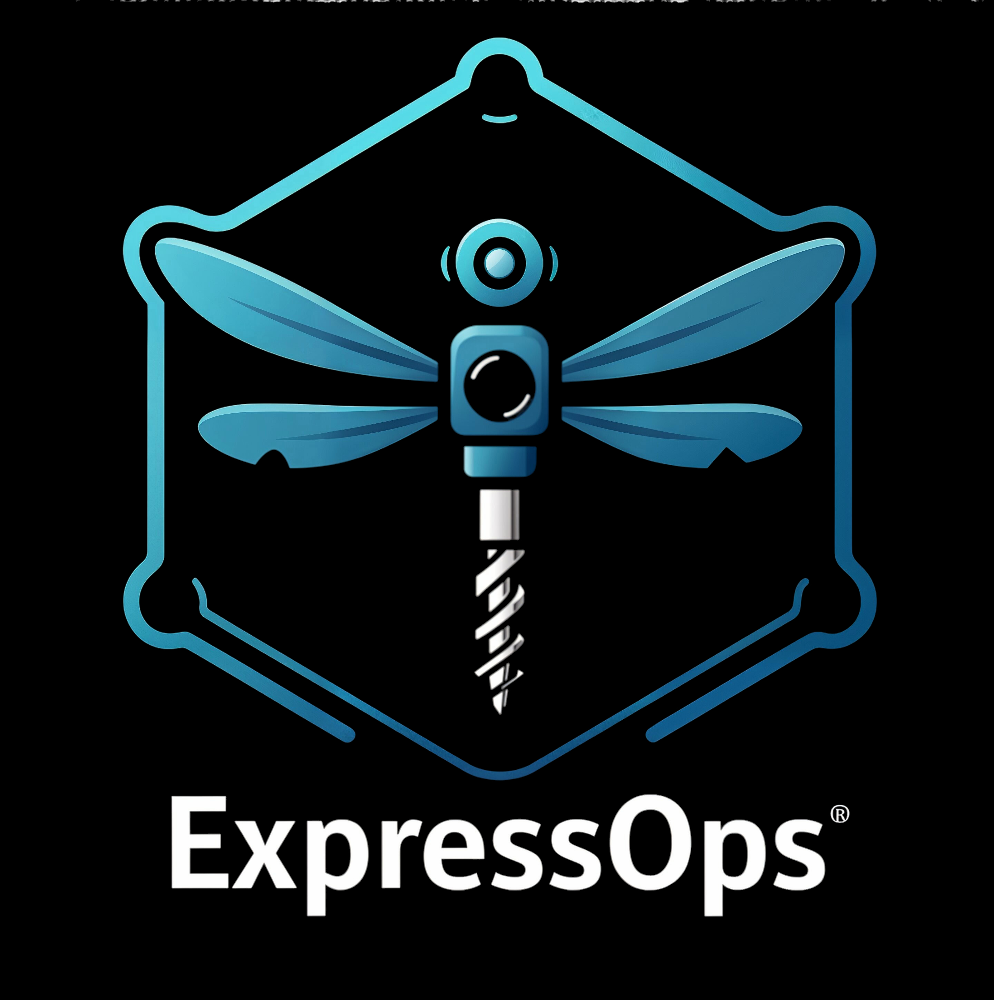

## ExpressOps 🚀 

> 🚨 <span style="color:red">**Note: Currently under active development**</span> - API and features may change without notice

<div align="left">
  
</div>

<br><br>


## 📜 Table of Contents

- [Features](#features)
- [Architecture](#-architecture-overview)
- [Requirements](#-requirements)
- [Installation](#-installation)
- [Usage](#-usage)
- [Configuration](#-configuration)
- [Docker](#docker)
- [Secret Management](#secret-management)
- [Kubernetes Deployment](#kubernetes-deployment)
- [Monitoring](#monitoring)
- [Terraform](#terraform)
- [Plugins](#-plugins)
- [Example Flows](#-example-flows)
- [Contributing](#contributing)
- [License](#license)
- [Acknowledgements](#-acknowledgements)

## Docker

Grab our image from Docker Hub:

```bash
docker pull davidnull/expressops:1.1.7
# or
docker pull expressopsfreepik/expressops:latest
```

*Note: This is a temporary location. We'll move to expressopsfreepik/expressops soon*

## 🧭 Architecture Overview


ExpressOps follows a modular architecture with three main components:
1. **Core Engine**: Handles configuration loading, plugin management, and server initialization
2. **Plugin System**: Dynamically loads and executes plugins through a standardized interface
3. **Flow Orchestration**: Manages the execution of plugin pipelines based on YAML configuration

## Features

ExpressOps comes with several ready-to-use plugins:

- 🔌 Dynamic plugin loading from `.so` files at runtime
- 🛠️ **Extensive plugin ecosystem**:
  - **System Operations**: Health checks, disk cleanup, and system monitoring
  - **Kubernetes**: K8s cluster health and management
  - **User Management**: User creation and permission management
  - **Notifications**: Slack integration for alerts and reports
  - **Utilities**: Data formatting, timeouts, and testing tools
- ⚙️ YAML-based flow configuration for defining execution pipelines
- 🌐 HTTP server with endpoints to trigger flows dynamically
- 📊 Metrics collection for monitoring system performance
- 📜 Detailed logging for debugging and traceability

## 🔧 Requirements

- 🐧 ExpressOps runs on Linux (due to the Go plugin system)
- Go 1.20+
- Docker (for containerized deployment)
- Kubernetes (for production)
- External Secrets Operator (for secret management)

## 🔧 Installation

```bash
git clone https://github.com/freepik-company/expressops
cd expressops
make build
```

This will build the main application and all available plugins. If you want to build specific plugins manually:

```bash
go build -buildmode=plugin -o plugins/slack/slack.so plugins/slack/slack.go
go build -buildmode=plugin -o plugins/healthcheck/health_check.so plugins/healthcheck/health_check.go
go build -buildmode=plugin -o plugins/formatters/health_alert_formatter.so plugins/formatters/health_alert_formatter.go
```

## 🛠️ Usage

Start the server with your configuration file:

```bash
./expressops -config docs/samples/config.yaml
```

Or use the default configuration:

```bash
./expressops
```

Run a flow:
```bash
curl "http://localhost:8080/flow?flowName=dr-house&format=verbose"
curl "http://localhost:8080/flow?flowName=alert-flow"
```

### Environment Variables

- `SERVER_PORT`: HTTP port (default: 8080)
- `SERVER_ADDRESS`: Listen address (default: 0.0.0.0)
- `TIMEOUT_SECONDS`: Execution timeout in seconds (default: 4)
- `LOG_LEVEL`: Logging level (info, debug, warn, error)
- `LOG_FORMAT`: Log format (text, json)
- `SLACK_WEBHOOK_URL`: Required for Slack notifications

## 🛠️ Makefile Commands

ExpressOps includes a comprehensive Makefile with various commands to simplify development, building, and deployment:

### Basic Commands
- `make build` - Build plugins and application locally
- `make run` - Run application locally
- `make help` - Display all available commands and current configuration
- `make quick-help`: Essential frequently-used commands
- `make about`: Basic project info
- `make config`: Current configuration

### Docker Workflow
- `make docker-build` - Build Docker image (auto-versioned) and update Helm values
- `make docker-run` - Run container with the last built tag
- `make docker-run-build` - Build and run Docker container
- `make docker-clean` - Clean Docker resources (stops/removes container and old tags)
- `make docker-push` - Tag and push the last built image to Docker Hub

### Helm Deployment
- `make helm-deploy` - Deploy/upgrade Helm chart using tag from values.yaml

### Combined Workflow
- `make release` - Complete release cycle: build, push, and deploy


## ⚙️ Configuration

ExpressOps uses a YAML configuration file that defines logging settings, server configuration, plugins, and flows:

```yaml
logging:
  level: info
  format: text

server:
  port: 8080
  address: 0.0.0.0
  timeoutSeconds: 4

plugins:
  - name: slack-notifier
    path: plugins/slack/slack.so
    type: notification
    config:
      webhook_url: $SLACK_WEBHOOK_URL

flows:
  - name: alert-flow
    description: "Health check with notification"
    pipeline:
      - pluginRef: health-check-plugin
      - pluginRef: formatter-plugin
      - pluginRef: slack-notifier
```

## Secret Management

We use External Secrets Operator with Google Cloud Secret Manager:

1. **GCP Secrets**: 
   - Name: `slack-webhook`
   - Project: `fc-it-school-2025`

2. **Deployment with secrets**:
   ```bash
   # Make sure you have key.json in project root
   make setup-with-gcp-credentials
   
   # Or use Helm
   make helm-install-with-gcp-secrets
   ```

## Kubernetes Deployment

```bash
# Connect to Kubernetes
gcloud compute ssh --zone "europe-west1-d" "it-school-2025-1" --tunnel-through-iap --project "fc-it-school-2025" --ssh-flag "-N -L 6443:127.0.0.1:6443"

# Install ESO (first time)
make k8s-install-eso

# Deploy with secrets
export SLACK_WEBHOOK_URL="https://hooks.slack.com/services/YOUR/REAL/TOKEN"
make k8s-deploy-with-clustersecretstore

# Check deployment
make k8s-status
make k8s-port-forward
make k8s-logs
```

## Monitoring

ExpressOps includes Prometheus and Grafana monitoring:

```bash
# Install Prometheus
make prometheus-install PROMETHEUS_NAMESPACE=monitoring-david

# Install Grafana
make grafana-install PROMETHEUS_NAMESPACE=monitoring-david GRAFANA_RELEASE=grafana-david

# Access interfaces
make local-prometheus-port-forward PROMETHEUS_NAMESPACE=monitoring-david PROMETHEUS_PORT=9091
make grafana-port-forward PROMETHEUS_NAMESPACE=monitoring-david GRAFANA_RELEASE=grafana-david GRAFANA_PORT=3001
```

## Terraform

This project also supports deployment of its monitoring stack (OpenSearch, OpenSearch Dashboards, Fluent Bit) using Terraform. The Terraform configuration can be found in the `terraform/` directory.


## 🔌 Plugins

ExpressOps comes with a variety of plugins:

| Plugin | Type | Description |
|--------|------|-------------|
| health-check-plugin | health | Collects CPU, memory, and disk usage stats |
| kube-health-plugin | k8s | Monitors Kubernetes cluster health |
| formatter-plugin | utils | Transforms health data into a clean report |
| slack-notifier | notification | Sends messages to a Slack channel |
| sleep-plugin | test | Delays flow execution to test timeouts |
| test-print-plugin | test | Debug plugin that prints test data |
| permissions-plugin | management | Manages file permissions |
| user-creation-plugin | management | Creates system users |
| clean-disk-plugin | maintenance | Handles disk cleanup operations |

## 📋 Example Flows

### Health Check with Notification (alert-flow)

This flow performs a system health check, formats the results, and sends an alert to Slack:

```bash
curl "http://localhost:8080/flow?flowName=alert-flow"
```

### Dr. House

A flow that runs a health check, formats results, and displays a test message:

```bash
curl "http://localhost:8080/flow?flowName=dr-house"
```

### Flow Discovery

List all available flows:

```bash
curl "http://localhost:8080/flow?flowName=all-flows"
```

## Contributing

Want to contribute? Make sure to export your plugin as `PluginInstance` implementing the `Plugin` interface:

```go
type Plugin interface {
    Initialize(ctx context.Context, config map[string]interface{}, logger *logrus.Logger) error
    Execute(ctx context.Context, request *http.Request, shared *map[string]any) (interface{}, error)
    FormatResult(result interface{}) (string, error)
}
```

## License

Copyright 2025.

This project is licensed under the MIT License. See the [LICENSE](LICENSE) file for more information.

## 🙏 Acknowledgements

Thanks to all contributors and plugin authors who made this modular system possible.


