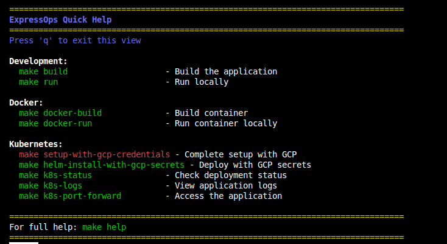

## ExpressOps  

> 🚨 <span style="color:red">**Note: Currently under active development**</span> - API and features may change without notice

ExpressOps: A lightweight flow orchestrator that:
- Loads plugins dynamically
- Chains plugins into workflows via YAML config
- Each plugin = one task (health checks, formatting, notifications, etc.)

## Docker

Grab our image from Docker Hub:

```bash
docker pull davidnull/expressops:1.1.5
```

*Note: This is a temporary location. We'll move to expressopsfreepik/expressops soon*

## Contents

- [Requirements](#requirements)
- [Installation](#installation)
- [Usage](#usage)
- [Configuration](#configuration)
- [Secret Management](#secret-management)
- [Example: Dr. House](#example-dr-house)
- [Contributing](#contributing)
- [License](#license)

## Architecture


## Available Plugins

ExpressOps comes with several ready-to-use plugins:

- **health-check-plugin**: Monitors CPU, memory and disk stats
- **formatter-plugin**: Transforms health data into readable reports
- **slack-notifier**: Sends alerts to Slack channels
- **sleep-plugin**: Simulates delays to test timeouts
- **test-print-plugin**: Helps with debugging

## Requirements

- Linux (mandatory due to Go's plugin system)
- Go 1.20+
- Docker (for containerized deployment)
- Kubernetes (for production)
- External Secrets Operator (for secret management)

## Installation

```bash
git clone https://github.com/freepik-company/expressops
cd expressops
make build
```

Building plugins manually:
```bash
go build -buildmode=plugin -o plugins/slack/slack.so plugins/slack/slack.go
go build -buildmode=plugin -o plugins/healthcheck/health_check.so plugins/healthcheck/health_check.go
go build -buildmode=plugin -o plugins/formatters/health_alert_formatter.so plugins/formatters/health_alert_formatter.go
```

## Usage

Start the server:
```bash
./expressops -config docs/samples/config.yaml
```

Run a flow:
```bash
curl "http://localhost:8080/flow?flowName=dr-house&format=verbose"
```

### Environment Variables

- `SERVER_PORT`: HTTP port (default: 8080)
- `SERVER_ADDRESS`: Listen address (default: 0.0.0.0)
- `TIMEOUT_SECONDS`: Execution timeout in seconds (default: 4)
- `LOG_LEVEL`: Logging level (info, debug, warn, error)
- `LOG_FORMAT`: Log format (text, json)
- `SLACK_WEBHOOK_URL`: Required for Slack notifications

## Help Commands

The Makefile includes built-in help:

- `make help`: Shows all available commands
- `make quick-help`: Essential frequently-used commands
- `make about`: Basic project info
- `make config`: Current configuration



## Secret Management

We use External Secrets Operator with Google Cloud Secret Manager:

1. **GCP Secrets**: 
   - Name: `slack-webhook`
   - Project: `fc-it-school-2025`

2. **Deployment with secrets**:
   ```bash
   # Make sure you have key.json in project root
   make setup-with-gcp-credentials
   
   # Or use Helm
   make helm-install-with-gcp-secrets
   ```

## Kubernetes Deployment

```bash
# Connect to Kubernetes
gcloud compute ssh --zone "europe-west1-d" "it-school-2025-1" --tunnel-through-iap --project "fc-it-school-2025" --ssh-flag "-N -L 6443:127.0.0.1:6443"

# Install ESO (first time)
make k8s-install-eso

# Deploy with secrets
export SLACK_WEBHOOK_URL="https://hooks.slack.com/services/YOUR/REAL/TOKEN"
make k8s-deploy-with-clustersecretstore

# Check deployment
make k8s-status
make k8s-port-forward
make k8s-logs
```

## Monitoring

ExpressOps includes Prometheus and Grafana monitoring:

```bash
# Install Prometheus
make prometheus-install PROMETHEUS_NAMESPACE=monitoring-david

# Install Grafana
make grafana-install PROMETHEUS_NAMESPACE=monitoring-david GRAFANA_RELEASE=grafana-david

# Access interfaces
make local-prometheus-port-forward PROMETHEUS_NAMESPACE=monitoring-david PROMETHEUS_PORT=9091
make grafana-port-forward PROMETHEUS_NAMESPACE=monitoring-david GRAFANA_RELEASE=grafana-david GRAFANA_PORT=3001
```

Grafana credentials: admin/admin123

## Configuration Example

```yaml
plugins:
  - name: slack-notifier
    path: plugins/slack/slack.so
    type: notification
    config:
      webhook_url: $SLACK_WEBHOOK_URL

flows:
  - name: alert-flow
    pipeline:
      - pluginRef: health-check-plugin
      - pluginRef: formatter-plugin
      - pluginRef: slack-notifier
```

## Example: Dr. House

A flow that runs a health check, formats results, and displays a test message:

```bash
curl "http://localhost:8080/flow?flowName=dr-house&format=verbose"
```

## Flow Discovery

List all available flows:

```bash
curl "http://localhost:8080/flow?flowName=all-flows"
```

## Contributing

Want to contribute? Make sure to export your plugin as `PluginInstance` implementing the `Plugin` interface:

```go
type Plugin interface {
    Initialize(ctx context.Context, config map[string]interface{}, logger *logrus.Logger) error
    Execute(ctx context.Context, request *http.Request, shared *map[string]any) (interface{}, error)
    FormatResult(result interface{}) (string, error)
}
```

## License

Copyright 2025.
Licensed under the MIT License. See [LICENSE](LICENSE) file for details.
